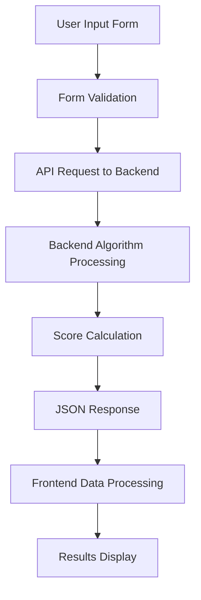

# 🏭 Starboard Industrial Property Comparison Platform

A modern, AI-powered web application for finding comparable industrial properties with intelligent scoring algorithms and comprehensive market analysis.

## 🎯 Project Overview

Starboard is a React-based frontend application that connects to a sophisticated backend API to help users find comparable industrial properties. The platform uses advanced algorithms to analyze property characteristics and provide detailed compatibility scoring.

### ✨ Key Features

- **🔍 Intelligent Property Search**: Input property details (location, size, year built, zoning) to find matches
- **🤖 AI-Powered Scoring**: Advanced algorithms calculate compatibility scores based on multiple factors
- **📊 Detailed Score Breakdown**: Expandable views showing location, size, age, and zoning match percentages
- **🏢 Real Property Data**: Integration with live backend database containing actual property information
- **🎨 Modern UI/UX**: Beautiful glassmorphism design with smooth animations and transitions
- **📱 Responsive Design**: Optimized for desktop, tablet, and mobile devices

## 🏗️ Architecture Overview

### Frontend Stack
- **Framework**: React 18 with TypeScript
- **Build Tool**: Vite for fast development and optimized builds
- **Styling**: Tailwind CSS with custom design system
- **UI Components**: Shadcn/UI component library
- **Icons**: Lucide React
- **Routing**: React Router DOM
- **State Management**: React hooks (useState, useEffect)

## 🔄 Data Flow & API Integration

### 1. Property Search Process



### 2. API Endpoints Used

#### **POST /comparable**
```typescript
// Request Format
{
  latitude: number,      // Property latitude coordinate
  longitude: number,     // Property longitude coordinate  
  square_feet: number,   // Building square footage
  year_built: number,    // Construction year
  zoning: string         // Zoning classification
}

// Response Format
[
  {
    id: string,
    score: number,                    // Overall compatibility score
    breakdown: {
      location: number,               // Geographic proximity score
      size: number,                   // Size similarity score
      year_built: number,             // Age compatibility score
      zoning: number                  // Zoning match score
    },
    property: {
      id: string,
      address: string,                // Property address
      latitude: number,
      longitude: number,
      square_feet: number,
      year_built: number,
      zoning: string
    }
  }
]
```

### 3. Data Processing Pipeline

1. **Input Validation**: Frontend validates all required fields before API call
2. **API Request**: Sends structured JSON payload to backend
3. **Algorithm Processing**: Backend analyzes property database using AI algorithms
4. **Score Calculation**: Multi-factor scoring based on:
   - Geographic proximity (location matching)
   - Size similarity (square footage comparison)
   - Age compatibility (construction year analysis)
   - Zoning classification matching
5. **Response Handling**: Frontend processes JSON response and formats for display
6. **Result Visualization**: Properties displayed with detailed score breakdowns

## 📁 Project Structure

```
src/
├── pages/                     # Main application pages
│   ├── Index.tsx             # Landing/home page
│   ├── PropertySearch.tsx    # Property search form
│   ├── Results.tsx           # Search results display
│   └── NotFound.tsx          # 404 error page
├── components/               # Reusable UI components
│   └── ui/                   # Shadcn/UI component library
├── hooks/                    # Custom React hooks
│   ├── use-toast.ts          # Toast notification system
│   └── use-mobile.tsx        # Mobile detection hook
├── lib/                      # Utility functions
│   └── utils.ts              # Common utility functions
├── assets/                   # Static assets
│   └── hero-industrial.jpg   # Hero section background
├── App.tsx                   # Main application component
├── main.tsx                  # Application entry point
└── index.css                 # Global styles and Tailwind
```

## 🚀 Getting Started

### Prerequisites
- Node.js 16+ and npm
- Modern web browser with ES6+ support

### Installation & Development

```bash
# Clone the repository
git clone https://github.com/icyhii/industrial-match-starboard-ui.git

# Navigate to project directory
cd industrial-match-starboard-ui

# Install dependencies
npm install

# Start development server
npm run dev

# Open in browser
http://localhost:8081
```

### Build for Production

```bash
# Create optimized production build
npm run build

# Preview production build locally
npm run preview
```

## 🔍 API Integration Details

### Request/Response Flow

1. **User submits search form** with property details
2. **Frontend validates** all required fields (lat/lng, size, year, zoning)
3. **API request sent** to backend with JSON payload
4. **Backend processes** request using AI algorithms
5. **Database queried** for matching properties
6. **Scoring calculated** based on multiple factors
7. **Results returned** as JSON array sorted by compatibility score
8. **Frontend displays** results with interactive score breakdowns

### Error Handling

- **Network Errors**: User-friendly messages for connection issues
- **Validation Errors**: Real-time form validation feedback
- **API Errors**: Graceful handling of backend errors
- **Loading States**: Visual feedback during API calls


## 📄 License

This project is licensed under the MIT License - see the LICENSE file for details.

## 🏢 Industrial Property Intelligence

Starboard represents the next generation of commercial real estate technology, combining modern web development with sophisticated property analysis algorithms to deliver actionable insights for industrial property professionals.

---